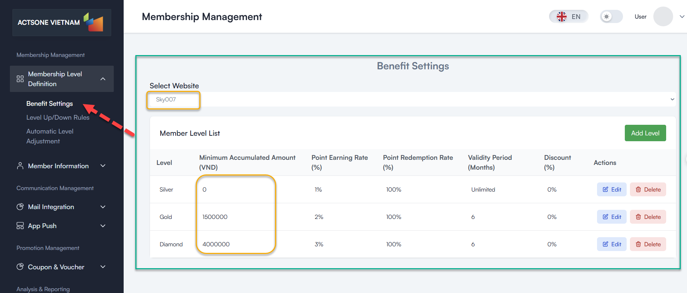
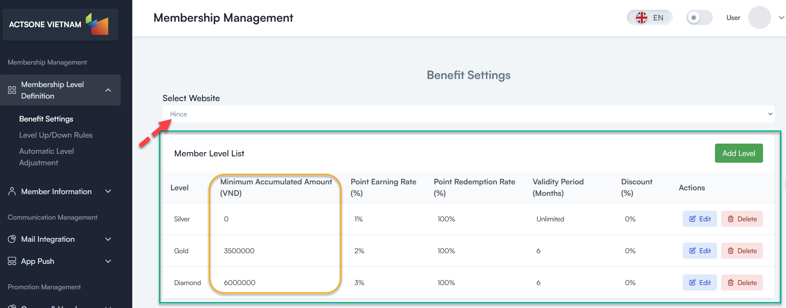
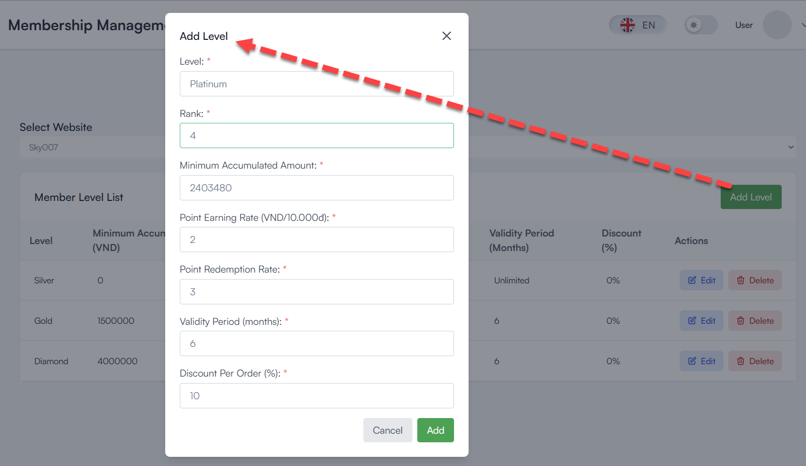
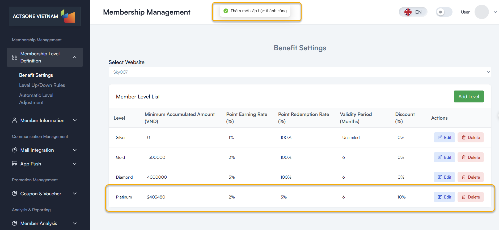
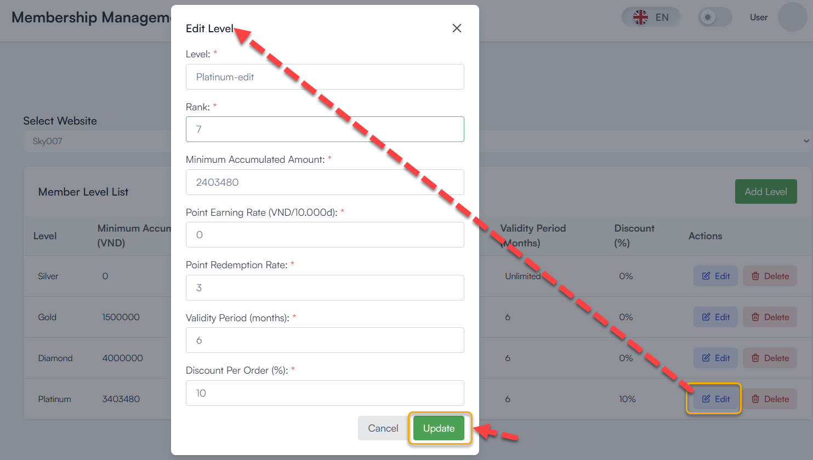
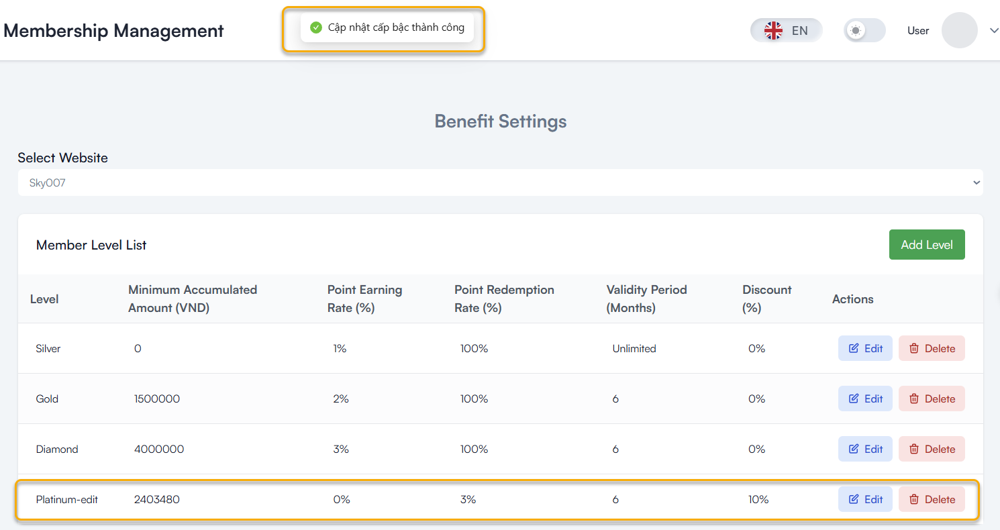
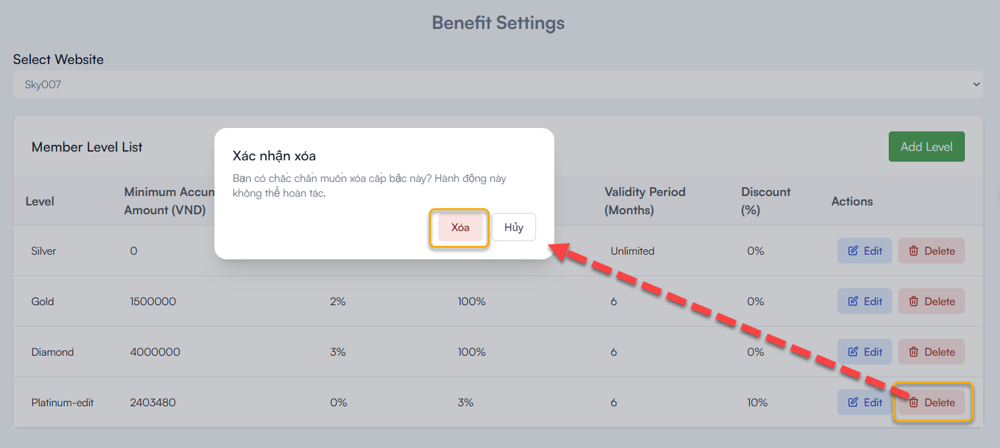
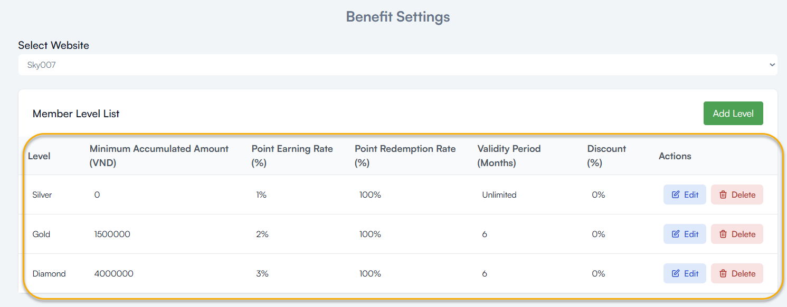

# Benefit Settings

## Table of contents
- [Overview](#overview)
- [Prerequisites](#prerequisites)
- [Step-by-Step Instructions](#step-by-step-instructions)
  - [1. Access Benefit Settings](#1-access-benefit-settings)
  - [2. Add a New Membership Level](#2-add-a-new-membership-level)
  - [3. Edit an Existing Membership Level](#3-edit-an-existing-membership-level)
  - [4. Delete a Membership Level](#4-delete-a-membership-level)
- [Best Practices](#best-practices)
- [Troubleshooting](#troubleshooting)
- [FAQ](#faq)

## Overview

The Benefit Settings feature allows you to define different membership levels and set up corresponding benefits such as point earning rates, redemption rates, and discounts for each level.

## Prerequisites

Before you begin, ensure you have:
- Admin or Manager access rights
- Defined membership strategy
- Information about the membership levels to create
- **After creating the level on the system, check it again on the wordpress website**

## Step-by-Step Instructions

### 1. Access Benefit Settings

1. Log in to the administration system
2. From the left menu, select **Membership Management > Membership Level Definition > Benefit Settings**
3. Select a website from the dropdown menu to view existing membership levels

### 2. Add a New Membership Level

1. Click the **"Add Level"** button in the top right corner
2. Fill in the form with the following information:
   - **Level Name**: Name of the level (e.g., Silver, Gold, Diamond)
   - **Rank**: Numerical rank of the level (used for ordering)
   - **Minimum Accumulated Amount**: Minimum spending threshold required
   - **Point Earning Rate (%)**: Percentage of points earned on purchases
   - **Point Redemption Rate**: Value per point when redeemed
   - **Validity Period (Months)**: Duration of the level once achieved
   - **Discount Per Order (%)**: Percentage discount on each order

3. Click **"Add"** to save the new level

### 3. Edit an Existing Membership Level

1. Find the level you want to edit in the list
2. Click the **Edit** icon (pencil)
3. Update the information in the form
4. Click **"Update"** to save changes

### 4. Delete a Membership Level

1. Find the level you want to delete in the list
2. Click the **Delete** icon (trash can)
3. Confirm the action in the confirmation dialog

## Best Practices

- **Create a clear level structure** with increasing benefits as levels increase
- **Balance point earning rates** with business costs
- **Set appropriate validity periods** to encourage frequent purchasing
- **Check for duplicate ranks and names** before adding

## Troubleshooting

- **Cannot add a new level**:
  - Check if the level name or rank already exists
  - Ensure all required fields are filled
  - Verify network connection

- **Changes not saving**:
  - Refresh the page and try again
  - Check network connection

## FAQ

**Q**: Is there a limit to how many levels I can create?
**A**: No hard limit exists, but 3-5 levels is recommended for clarity.

**Q**: Can I set different point earning rates higher than 100%?
**A**: Yes, in the latest version there is no cap on point earning rates.

**Q**: When do level changes take effect?
**A**: Changes take effect immediately, but member reclassification happens during the next evaluation cycle.

---
Last Updated: 2025-03-19
