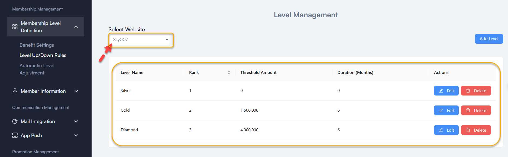
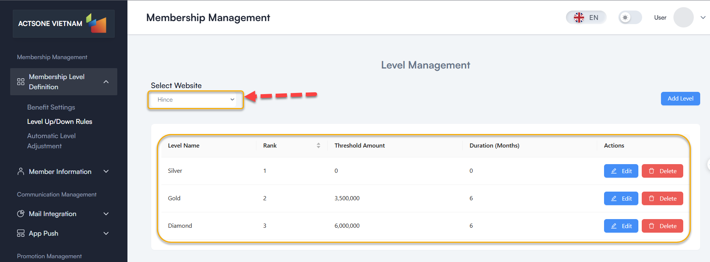
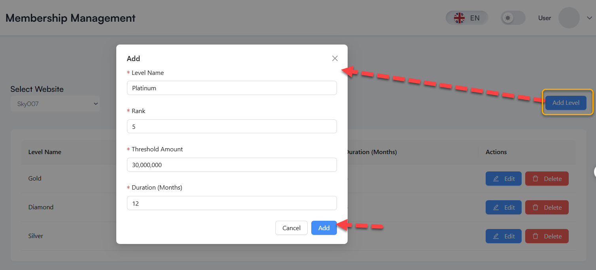
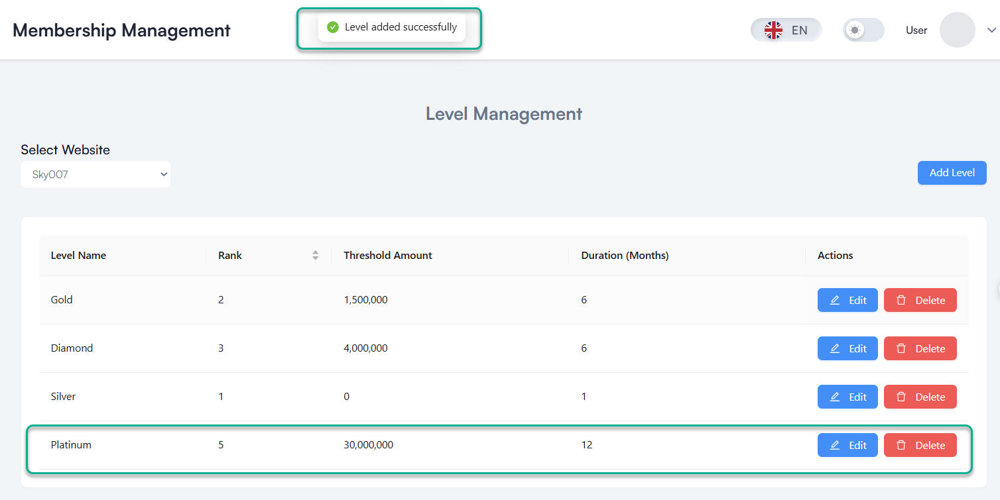
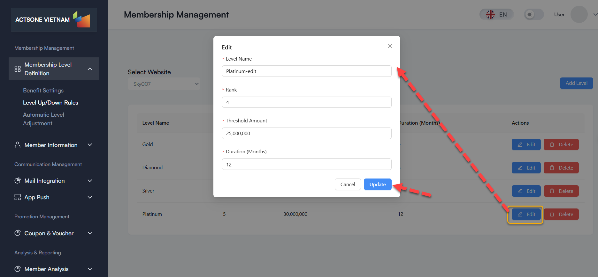
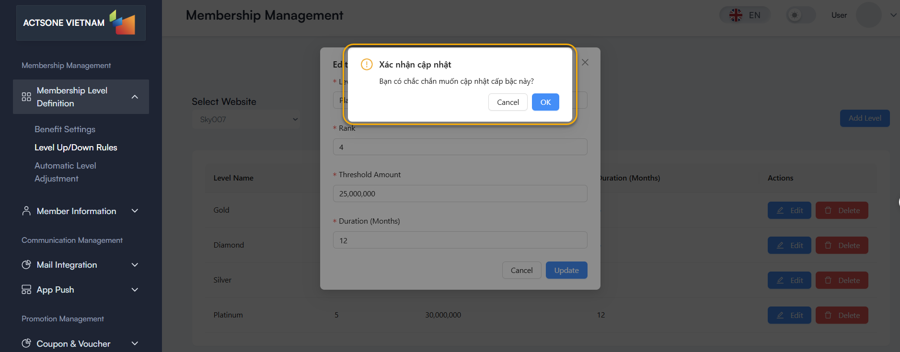
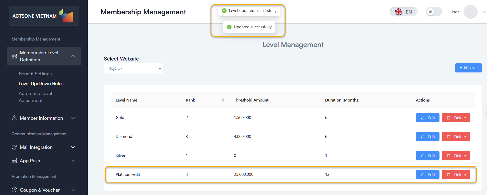
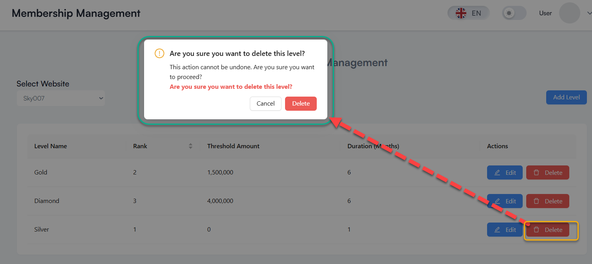
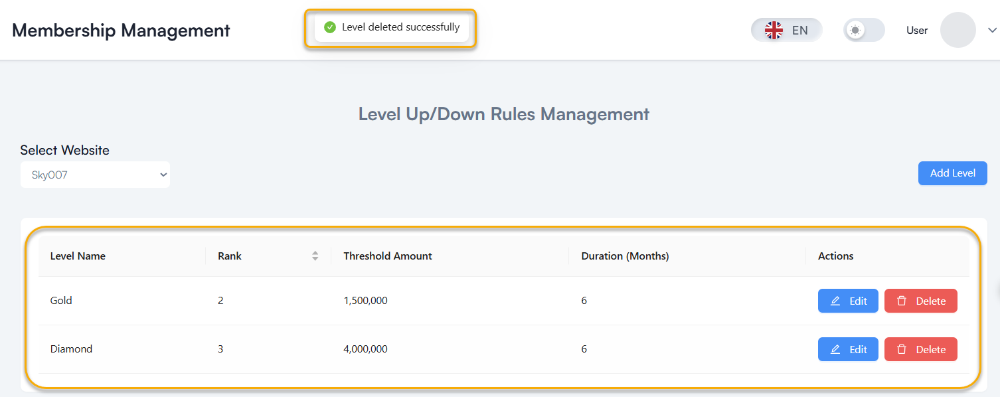

# Level Up/Down Rules

## Table of contents
- [Overview](#overview)
- [Prerequisites](#prerequisites)
- [Step-by-Step Instructions](#step-by-step-instructions)
  - [1. Access Level Up/Down Rules](#1-access-level-updown-rules)
  - [2. Configure Level Upgrade Rules](#2-configure-level-upgrade-rules)
  - [3. Configure Level Downgrade Rules](#3-configure-level-downgrade-rules)
  - [4. Set Up Evaluation Cycle](#4-set-up-evaluation-cycle)
- [Best Practices](#best-practices)
- [Troubleshooting](#troubleshooting)
- [FAQ](#faq)

## Overview

The Level Up/Down Rules feature allows you to define conditions for members to move between different membership levels. These rules determine how members upgrade to higher tiers or downgrade to lower ones.

## Prerequisites

Before you begin, ensure you have:
- Admin or Manager access rights
- Membership levels already configured in Benefit Settings
- Clear understanding of your membership strategy

## Step-by-Step Instructions

### 1. Access Level Up/Down Rules

1. Log in to the administration system
2. From the left menu, select **Membership Management > Membership Level Definition > Level Up/Down Rules**
3. Select a website from the dropdown menu to view existing rules

### 2. Add a new Level Upgrade Rules

1. Click the **"Add Level"** button in the top right corner
2. Fill in the form with the following information:
   - **Level Name**: Name of the level (e.g., Silver, Gold, Diamond), Don't input a level name that is the same as an existing level name.
   - **Rank**: Numerical rank of the level (used for ordering), Don't input a rank level that is the same as an existing rank.
   - **Threshold Amount**: Minimum spending threshold required
   - **Duration (month)**: Percentage of points earned on purchases
   
3. Click **"Add"** to create the rule of level

### 3. Edit an existing Level Up/Down Rules

1. Find the level you want to edit in the list
2. Click the **Edit** icon (pencil)
3. Update the information in the form
4. Click **"Update"** to save changes
5. Click confirm **"OK"** to edit the rule

### 4. Delete a Level Up/Down Rules

1. Find the level you want to delete in the list
2. Click the **Delete** icon (trash can)
3. Confirm the action in the confirmation dialog

## Best Practices

- **Create a clear pathway** for members to understand how to reach higher tiers
- **Consider both spending requirements and frequency** to encourage regular purchases
- **Set evaluation periods that align** with your customers' buying cycles
- **Send notifications before downgrading** to give members an opportunity to maintain their tier

## Troubleshooting

- **Members not upgrading**:
  - Check if members meet all conditions
  - Verify evaluation cycle is correctly configured

- **New rules not taking effect**:
  - Check start date is correct
  - Ensure configuration is saved after changes

## FAQ

**Q**: Can I have multiple upgrade paths for the same level?
**A**: Yes, you can create multiple upgrade paths with different conditions.

**Q**: Do members receive notifications about upcoming level changes?
**A**: Yes, if you enable notifications in the configuration.

**Q**: Can I set product-specific criteria?
**A**: The current version bases criteria on total spending and frequency. Product-specific criteria are planned for future releases.

---
Last Updated: 2025-03-20
