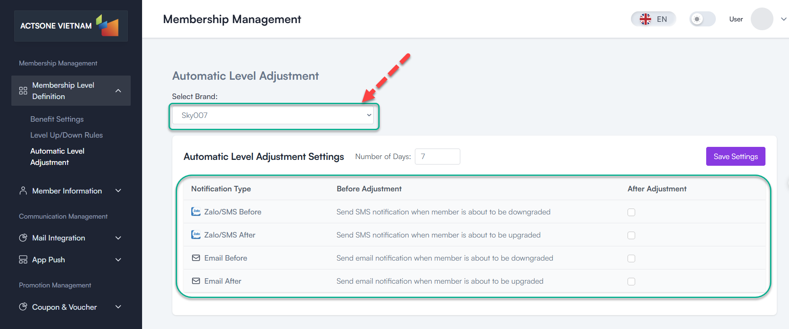
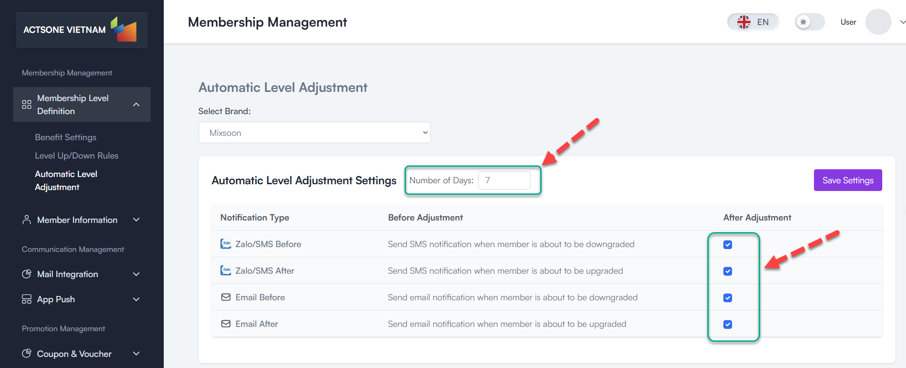

# Automatic Level Adjustment

## Table of contents
- [Overview](#overview)
- [Prerequisites](#prerequisites)
- [Step-by-Step Instructions](#step-by-step-instructions)
  - [1. Access Automatic Level Adjustment](#1-access-automatic-level-adjustment)
  - [2. Configure Notification Settings](#2-configure-notification-settings)
  - [3. Set Advanced Parameters](#3-set-advanced-parameters)
  - [4. View Adjustment History](#4-view-adjustment-history)
- [Best Practices](#best-practices)
- [Troubleshooting](#troubleshooting)
- [FAQ](#faq)

## Overview

The Automatic Level Adjustment feature automates the process of upgrading or downgrading member levels based on the rules you've defined. This feature helps maintain accurate member classifications without manual intervention.

## Prerequisites

Before you begin, ensure you have:
- Admin or Manager access rights
- Level Up/Down Rules already configured
- Notification templates set up (if using notifications)

## Step-by-Step Instructions

### 1. Access Automatic Level Adjustment

1. Log in to the administration system
2. From the left menu, select **Membership Management > Membership Level Definition > Automatic Level Adjustment**
3. Select a brand from the dropdown menu to configure settings

### 2. Configure Notification Settings

1. In the **"Notification Settings"** section:
   - Set **"Days Before Downgrade"**: Number of days before downgrade to notify members
   - Configure notification methods:
     - **Email Before Downgrade**: Toggle to enable/disable
     - **Email After Downgrade**: Toggle to enable/disable
     - **Zalo OA Before Downgrade**: Toggle to enable/disable
     - **Zalo OA After Downgrade**: Toggle to enable/disable

2. Click **"Save Settings"** to apply changes

### 3. View Adjustment History

1. Scroll down to the **"Adjustment History"** table
2. View information about past level adjustments:
   - **Date**: When adjustment occurred
   - **Member**: Affected member
   - **Previous Level**: Original level
   - **New Level**: Updated level
   - **Reason**: Why the adjustment occurred

3. Use filters to find specific adjustments

<!--  -->

## Best Practices

- **Review adjustment logs regularly** to ensure the system is working as expected
- **Test notification templates** before enabling them system-wide
- **Consider business cycles** when setting evaluation periods
- **Balance automatic rules with manual exceptions** for VIP members

## Troubleshooting

- **Adjustments not running**:
  - Check if evaluation schedule is correctly configured
  - Verify system task scheduler is running
  - Check for errors in logs

- **Notifications not sending**:
  - Verify notification settings are enabled
  - Check notification templates exist and are valid
  - Confirm email/SMS services are properly configured

## FAQ

**Q**: How frequently does the system evaluate levels?
**A**: This depends on your configuration in the Level Up/Down Rules section. Typically monthly, quarterly, or yearly.

**Q**: Can I exclude certain members from automatic adjustments?
**A**: Yes, you can set up exclusion rules for VIP members or special cases.

**Q**: What happens if a member doesn't meet criteria for any level?
**A**: The system will assign them to the default level (usually the lowest tier).

---
Last Updated: 2025-03-19