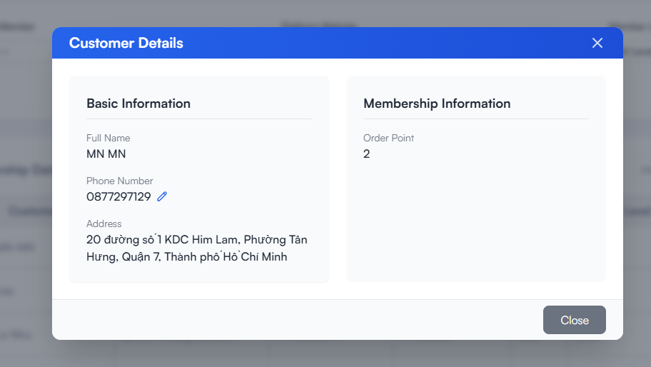

# Profile Management

## Table of contents
- [Overview](#overview)
- [Prerequisites](#prerequisites)
- [Step-by-Step Instructions](#step-by-step-instructions)
  - [1. Access Profile Management](#1-access-profile-management)
  - [2. Search and Filter Members](#2-search-and-filter-members)
  - [3. View Member Details](#3-view-member-details)
  - [4. Edit Member Information](#4-edit-member-information)
  - [5. Export Member Data](#5-export-member-data)
- [Best Practices](#best-practices)
- [Troubleshooting](#troubleshooting)
- [FAQ](#faq)

## Overview

The Profile Management feature allows you to view, search, edit, and manage personal information for all members in the system. It provides a comprehensive view of your membership base.

## Prerequisites

Before you begin, ensure you have:
- Admin or Manager access rights
- Search criteria for finding specific members
- Understanding of data privacy regulations

## Step-by-Step Instructions

### 1. Access Profile Management

1. Log in to the administration system
2. From the left menu, select **Membership Management > Member Information > Profile Management**

### 2. Search and Filter Members
- **2.1. Tab Date Join Member:** Apply filters to refine your filter:
   - **Date Join Member**: Filter by start date - end date
   - **Platform Website**: Filter by website
   - **Member Level**: Filter by membership level
+ **Select Button:**
  - Click **"Filter"** to apply filters
  - Click **"Reset"** to reset options filters

- **2.2. Tab Date Of Birth:** Apply filters to refine your filter:
   - **Date of Birth**: Filter by month
   - **Platform Website**: Filter by website
+ **Select Button:**
  - Click **"Filter"** to apply filters
  - Click **"Reset"** to reset options filters

- **2.3. Tab Order Date:** Apply filters to refine your filter:
   - **Order Date**: Filter by start date - end date
   - **Platform Website**: Filter by website
+ **Select Button:**
  - Click **"Filter"** to apply filters
  - Click **"Reset"** to reset options filters

- **2.4. Search Customer Name:** Input text to search with customer name:

### 3. View Member Details

1. From the results list, click on a member's name or the **"Details"** button
2. View comprehensive member information:
   - **Personal Information**: Name, email, phone, address
   - **Membership Information**: Level, current points, expiration date
   - **Registration Information**: Join date, registration source
   - **Recent Interactions**: Latest activities

### 4. Edit Member Information

1. In the member details page, click the **"Edit"** button
2. Update necessary information:
   - **Personal Information**: edit phone number
   - **Address**: edit address, city, district
   <!-- - **Additional Information**: Birth date, gender -->
   <!-- - **Notes**: Add notes about the member -->
3. Click **"Save Changes"** to update

### 5. Order History

1. In the Membership Data table, click the **"History"** icon in Actions column    

### 6. Point Reward

1. In the Membership Data table, click the **"Point Reward"** icon in Actions column
2. View detailed point history:
   - **Date**: Timestamp of the point transaction
   - **Description**: Details about the transaction
   - **Points**: Point amount changed
   - **Total points**: Total points redeemed
   - **Order ID**: ID of each order

1. Click the **"Point Reward"** icon
2. Fill in the form:
   - **Points**: Number of points to adjust
   - **Adjustment Reason**: Reason for adjustment (required)

3. Click **"Apply Adjustment"** to process the adjustment

### 7. Export Member Data

1. From the member list page, click the **"Export Excel"** button
2. Select the fields to include in the export
3. Click **"Export"** to download the Excel file

## Best Practices

- **Update information regularly** to maintain data accuracy
- **Use filters effectively** to find specific member segments
- **Document changes** when editing important information
- **Regularly verify** contact information for key members

## Troubleshooting

- **Cannot find a member**:
  - Check spelling of search terms
  - Try searching with different information (email instead of name)
  - Expand filters to broaden search

- **Cannot edit information**:
  - Check your access permissions
  - Refresh the page and try again

## FAQ

**Q**: Can I add a new member from this section?
**A**: No, new members must be added through the "Create New Member" function in the main menu.

**Q**: How do I merge duplicate member profiles?
**A**: Contact the technical team to perform profile merging, as this requires database operations.

**Q**: Can I manually change a member's level?
**A**: Yes, you can modify the level in the edit section, but please note the reason for the change.

---
Last Updated: 2025-03-20