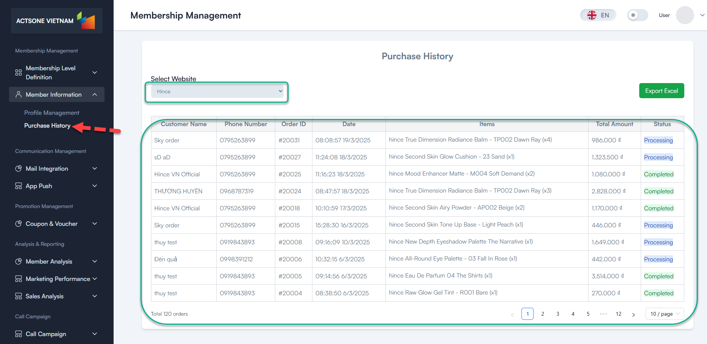
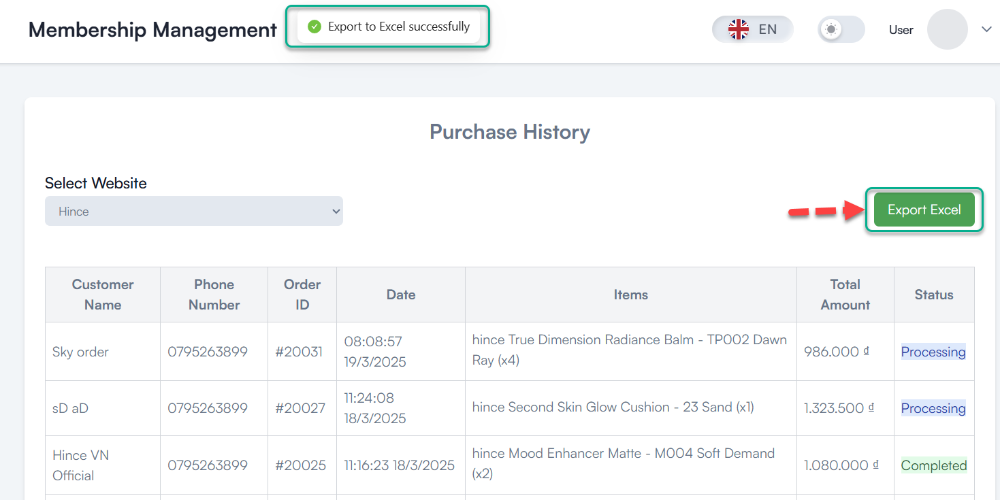

# Purchase History

## Table of contents
- [Overview](#overview)
- [Prerequisites](#prerequisites)
- [Step-by-Step Instructions](#step-by-step-instructions)
  - [1. Access Purchase History](#1-access-purchase-history)
  - [2. Search for a Member](#2-search-for-a-member)
  - [3. View Purchase Details](#3-view-purchase-details)
  - [4. Filter Purchase History](#4-filter-purchase-history)
  - [5. Export Purchase Data](#5-export-purchase-data)
- [Best Practices](#best-practices)
- [Troubleshooting](#troubleshooting)
- [FAQ](#faq)

## Overview

The Purchase History feature allows you to view and analyze all transactions made by members. This information is valuable for understanding buying patterns, calculating lifetime value, and providing personalized service.

## Prerequisites

Before you begin, ensure you have:
- Admin or Manager access rights
- Member information for looking up specific history
- Understanding of order status definitions

## Step-by-Step Instructions

### 1. Access Purchase History

1. Log in to the administration system
2. From the left menu, select **Membership Management > Member Information > Purchase History**

### 2. Search for a Member

1. Enter member information in the search field:
   - Name
   - Email
   - Phone number
   - Member ID

2. Click **"Search"** to find the member

<!--  -->

### 3. View Purchase Details

1. From the member's purchase history list, click on an order number to view details
2. View comprehensive order information:
   - **Order Information**: Order ID, date, status, total amount
   - **Product Details**: Products purchased, quantity, price
   - **Payment Information**: Payment method, transaction ID
   - **Shipping Details**: Shipping method, tracking number, address

<!--  -->

### 4. Filter Purchase History

1. Use the filter options to refine purchase history:
   - **Date Range**: Select specific time period
   - **Order Status**: Filter by status (Completed, Processing, Canceled)
   - **Amount Range**: Filter by order value
   - **Product**: Filter by specific product purchased

2. Click **"Apply Filters"** to update the display

<!--  -->

### 5. Export Purchase Data

1. After filtering as needed, click the **"Export"** button
2. Select format (Excel, CSV, PDF)
3. Choose what data to include
4. Click **"Export"** to download

## Best Practices

- **Review purchase patterns** to identify opportunities for upselling
- **Look for declining purchase frequency** to identify at-risk members
- **Compare purchase behavior** across different member levels
- **Monitor first-time vs. repeat purchases** to understand customer lifecycle

## Troubleshooting

- **Missing purchase data**:
  - Check if orders are correctly linked to the member profile
  - Verify integration with e-commerce platform is working
  - Ensure date filters are not excluding relevant transactions

- **Incorrect order amounts**:
  - Verify if refunds or adjustments have been applied
  - Check for currency conversion issues

## FAQ

**Q**: How far back does purchase history go?
**A**: The system retains all purchase history from when the integration was set up.

**Q**: Can I see which promotions were applied to a purchase?
**A**: Yes, promotion details are included in the order details view.

**Q**: Is it possible to manually add a purchase?
**A**: No, purchases must come through integrated systems to maintain data integrity.

---
<!-- Last Updated: 2025-03-19 -->