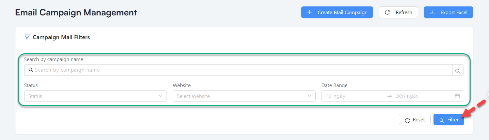

# Mail Campaign

## Table of contents
- [Overview](#overview)
- [Prerequisites](#prerequisites)
- [Step-by-Step Instructions](#step-by-step-instructions)
  - [1. Access Mail Campaigns](#1-access-mail-campaigns)
  - [2. Create a New Campaign](#2-create-a-new-campaign)
  - [3. Select Email Template](#3-select-email-template)
  - [4. Target Members](#4-target-members)
  - [5. Schedule and Launch](#5-schedule-and-launch)
  - [6. Monitor Performance](#6-monitor-performance)
- [Best Practices](#best-practices)
- [Troubleshooting](#troubleshooting)
- [FAQ](#faq)

## Overview

The Mail Campaign feature allows you to create, manage, and track email marketing campaigns to your membership base. You can use templates, target specific member segments, and analyze campaign performance.

## Prerequisites

Before you begin, ensure you have:
- Admin or Manager access rights
- Email templates created in Template Mail Management
- Clear campaign objectives
- Target audience identified
- Email service configured correctly

## Step-by-Step Instructions

### 1. Access Mail Campaigns

1. Log in to the administration system
2. From the left menu, select **Communication Management > Mail Integration > Mail Campaign**

### 2. Mail Campaign
#### 2.1 Create Mail Campaign

1. Click the **"Create Mail Campaign"** button
2. Enter campaign details:
   - **Campaign Name**: Clear, descriptive name.
   - **Campaign Description**: Campaign purpose and objectives.
   - **Website**: Select a platform website.
   - **Coupon name**: Select one or more coupons corresponding to the selected website.
   - **Person in charge**: Select one or more person in charge.
   - **Time of Sending**: Select from start date to end date of email campaign.
   - Click **Add member** button: Select one or more people to email in the member list.

3. Click **"Submit"** to continue

#### 2.2 Filter Mail Campaign
1. Enter filter mail campaign details:
   - **Search by Campaign Name**: Enter text to search by campaign name.
   - **Status**: Select a status in list.
   - **Website**: Select a platform website.
   - **Date Range**: Select from start date to end date.

2. Click **"Filter"** to filter
3. Click **"Reset"** to reset fields

#### 2.3 Export Excel list mail campaign
1. Click the **"Export Excel"** button

#### 2.4 Edit Mail Campaign
1. Click the **"Edit Mail Campaign"** icon in Action column
2. Enter edit mail campaign details:
   - **Campaign Name**: Enter change campaign name.
   - **Website**: Select a another platform website.
   - **Priority Level**: Select a another priority level in list.
   - **Status**: Select a another status in list.
   - **Date Range**: Select from start date to end date.

3. Click **"Save Changes"** to save Edit Mail Campaign 
4. Click **"Cancel"** to cancel Edit Mail Campaign modal

#### 2.5 Delete a mail campaign
1. Click the **"Delete Mail Campaign"** icon in Action column

## Best Practices

- **Use compelling subject lines** to improve open rates
- **Segment your audience** for more relevant messaging
- **Test emails across different devices** before sending
- **Schedule campaigns at optimal times** based on data
- **Include clear call-to-action** buttons
- **Keep mobile users in mind** with responsive design
- **Analyze performance** to continually improve

## Troubleshooting

- **High bounce rates**:
  - Clean your email list regularly
  - Verify email addresses are correctly formatted
  - Check for blacklisted domains

- **Low open rates**:
  - Test different subject lines
  - Verify emails aren't going to spam
  - Check sending reputation

- **Tracking not working**:
  - Ensure tracking pixels aren't blocked
  - Verify links have proper UTM parameters

## FAQ

**Q**: How many emails can I send in one campaign?
**A**: This depends on your email service provider limits, but the system will warn you if you exceed them.

**Q**: Can I edit a campaign after it's been launched?
**A**: You cannot edit a campaign that has already started sending, but you can pause it and create a new one.

**Q**: How long should I wait before following up with non-openers?
**A**: Best practice is to wait 3-5 days, then send a follow-up with a different subject line.

---
Last Updated: 2025-03-19