# Template Mail Management

## Table of contents
- [Overview](#overview)
- [Prerequisites](#prerequisites)
- [Step-by-Step Instructions](#step-by-step-instructions)
  - [1. Access Template Mail Management](#1-access-template-mail-management)
  - [2. Create a New Email Template](#2-create-a-new-email-template)
  - [3. Edit an Existing Template](#3-edit-an-existing-template)
  - [4. Preview and Test Templates](#4-preview-and-test-templates)
  - [5. Manage Template Categories](#5-manage-template-categories)
- [Best Practices](#best-practices)
- [Troubleshooting](#troubleshooting)
- [FAQ](#faq)

## Overview

The Template Mail Management feature allows you to create, edit, and organize email templates that can be used in email campaigns. These templates can include personalized content, images, and dynamic elements tailored to your brand.

## Prerequisites

Before you begin, ensure you have:
- Admin or Manager access rights
- Brand guidelines and visual assets ready for use
- Understanding of HTML and email design principles
- Knowledge of personalization variables available in the system

## Step-by-Step Instructions

### 1. Access Template Mail Management

1. Log in to the administration system
2. From the left menu, select **Communication Management > Mail Integration > Template Mail Management**

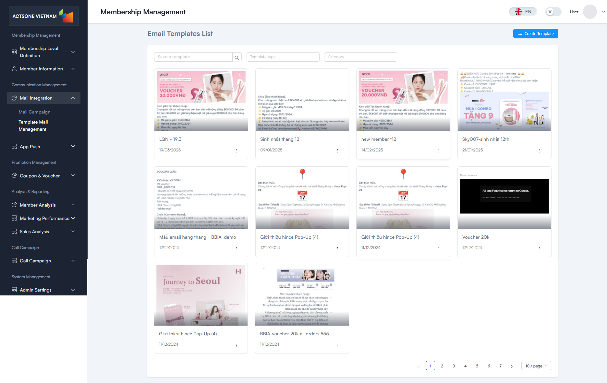

### 2. Create a New Email Template

1. Click the **"Create New Template"** button
2. Fill in the template details:
   - **Template Name**: Clear, descriptive name
   - **Subject Line**: Default subject for emails using this template
   - **Category**: Select or create a category
   - **From Name**: Sender name
   - **Reply-To Email**: Email address for replies

3. Design the template content using:
   - **Visual Editor**: Drag-and-drop interface
   - **HTML Editor**: Direct HTML code editing
   - **Template Blocks**: Reusable content sections

4. Add personalization variables using the `{{variable_name}}` syntax
5. Add images, buttons, and formatting as needed
6. Click **"Save Template"** to create

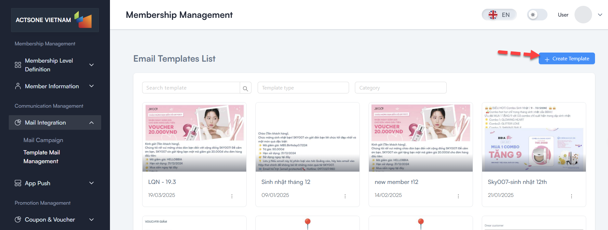
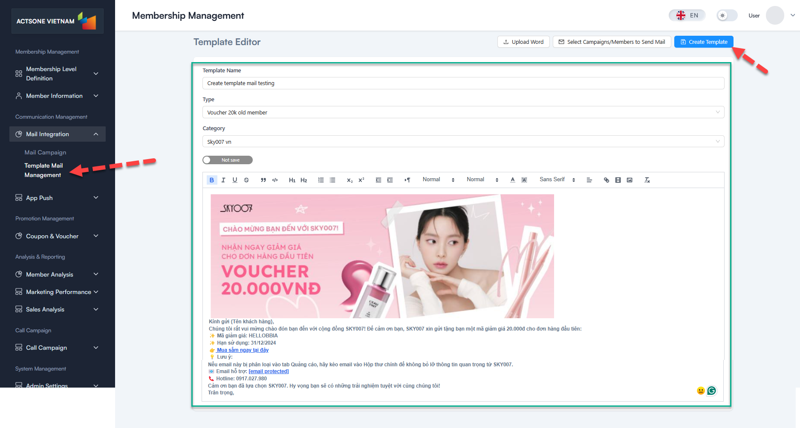

### 3. Edit an Existing Template

1. Find the template you want to edit in the list
2. Click the **Edit** icon (pencil)
3. Make changes to the template content or settings
4. Click **"Save Changes"** to update

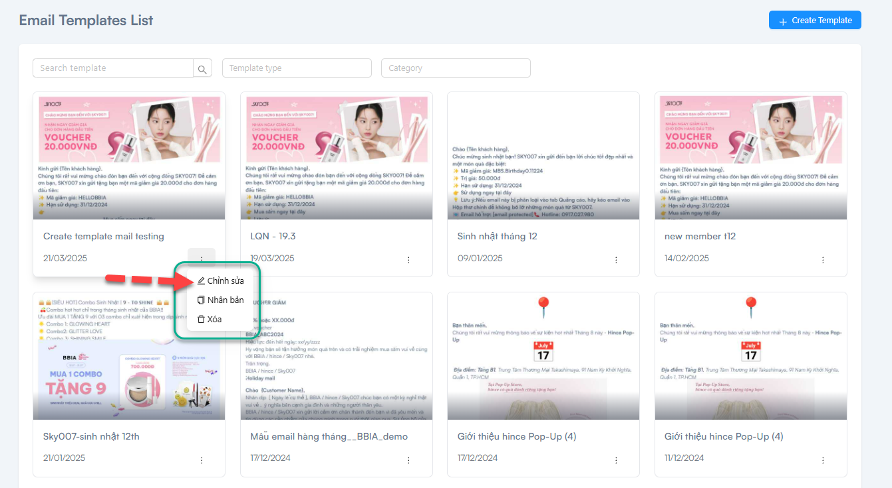
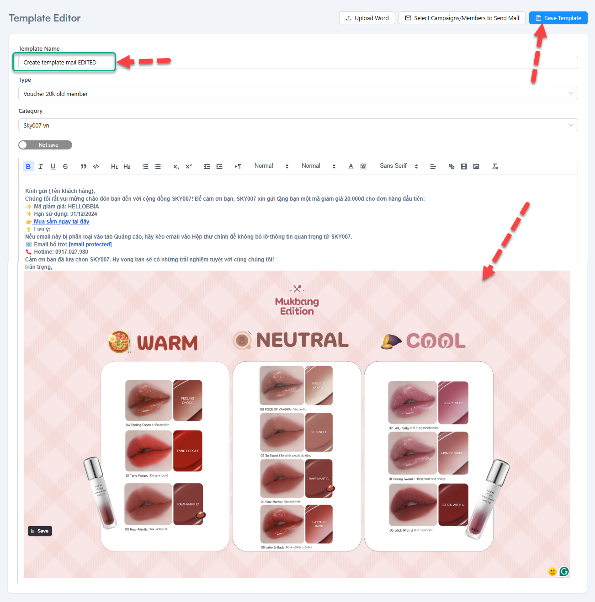
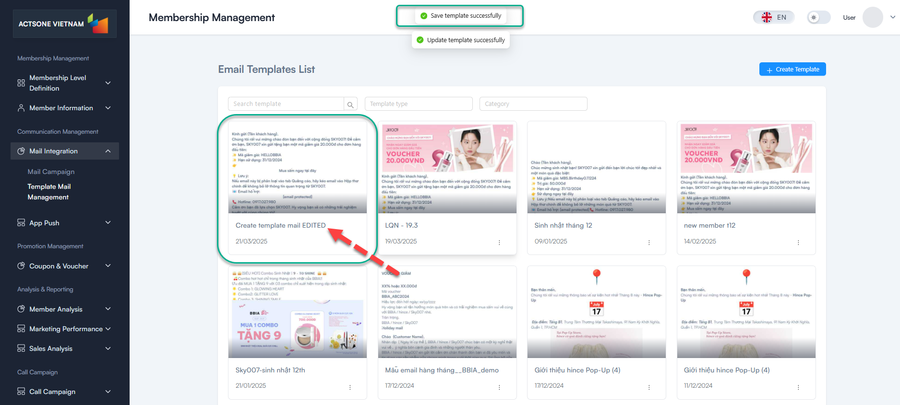

### 4. Send Mail Template

1. Click the **"Create New Template"** button
2. Fill in the template details:
   - **Template Name**: Clear, descriptive name
   - **Subject Line**: Default subject for emails using this template
   - **Category**: Select or create a category
   - **From Name**: Sender name
   - **Reply-To Email**: Email address for replies

3. Design the template content using:
   - **Visual Editor**: Drag-and-drop interface
   - **HTML Editor**: Direct HTML code editing
   - **Template Blocks**: Reusable content sections

4. Add personalization variables using the `{{variable_name}}` syntax
5. Add images, buttons, and formatting as needed
6. Click **"Save Template"** to create

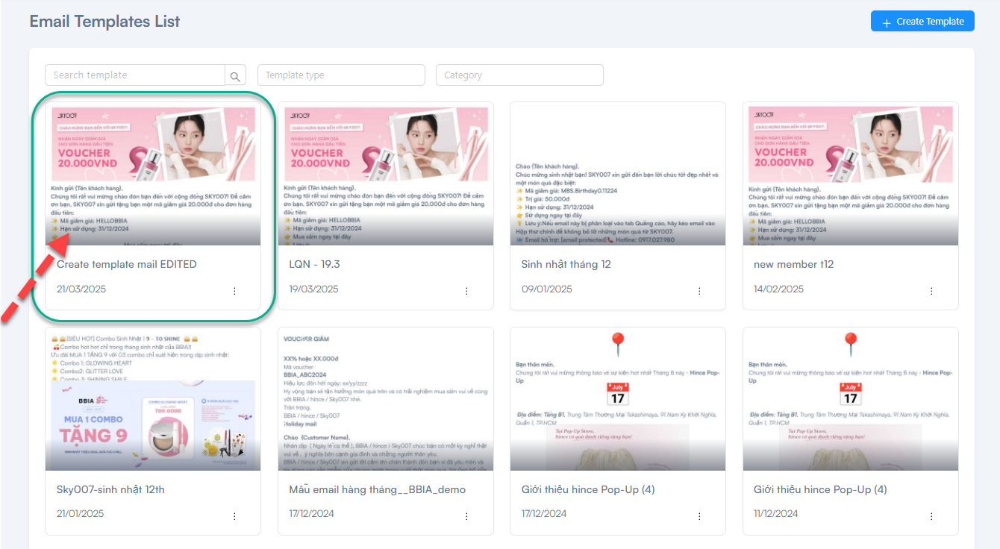
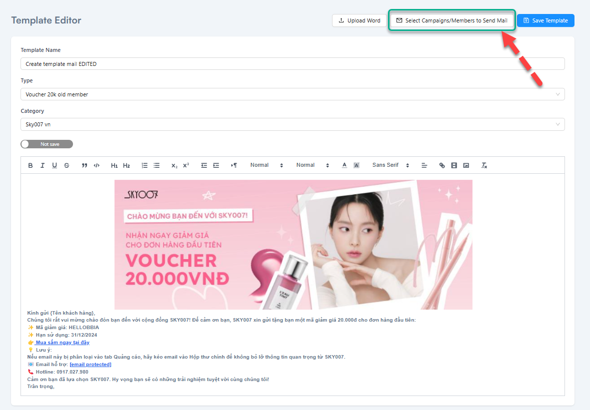
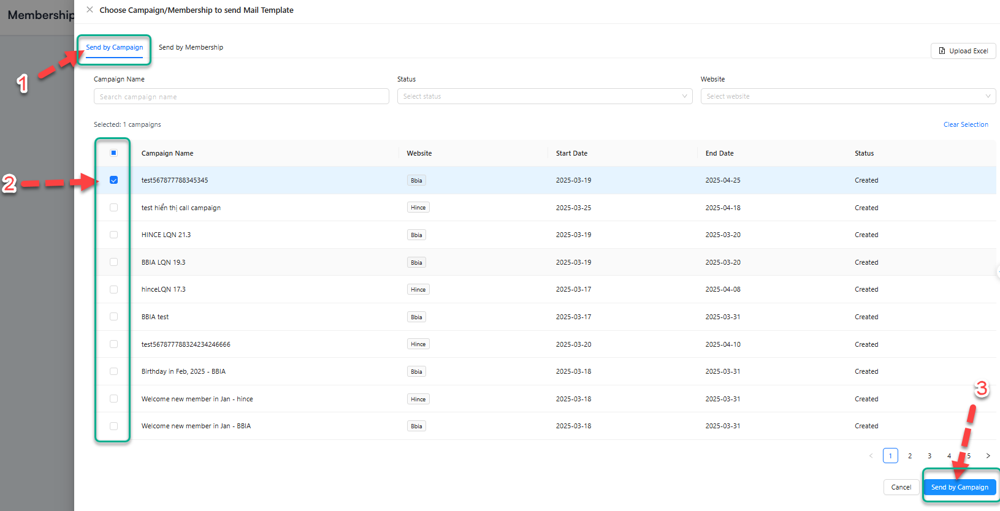
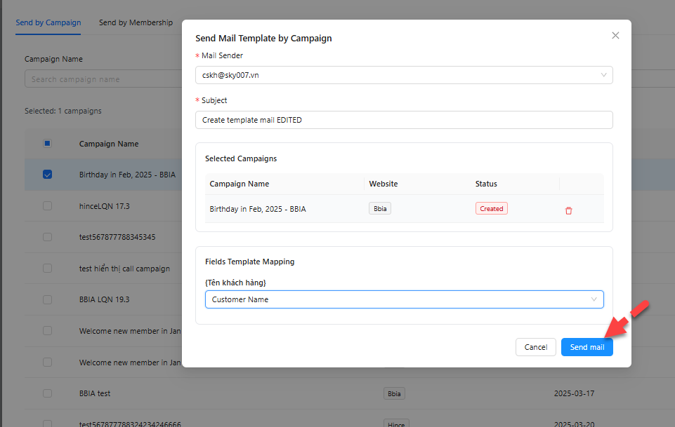
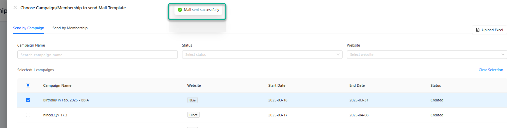

### 5. Manage Template Categories

1. Click the **"Manage Categories"** button
2. To add a new category:
   - Click **"Add Category"**
   - Enter category name
   - Click **"Save"**

3. To edit or delete categories:
   - Click the Edit or Delete icon next to the category
   - Make changes or confirm deletion

<!--  -->

## Best Practices

- **Keep templates responsive** for viewing on all devices
- **Use clear hierarchy** with headings and subheadings
- **Maintain consistent branding** across all templates
- **Include alt text for images** for accessibility
- **Test templates on multiple email clients** before using in campaigns
- **Organize templates into logical categories** for easier management

## Troubleshooting

- **Template not displaying correctly in tests**:
  - Check for HTML errors in the code
  - Verify image paths are correct
  - Test in multiple email clients for compatibility

- **Personalization variables not working**:
  - Ensure correct syntax `{{variable_name}}`
  - Verify the variable name exists in the system
  - Check if special characters are causing issues

## FAQ

**Q**: Is there a size limit for email templates?
**A**: Yes, it's recommended to keep the HTML size under 100KB to avoid clipping in some email clients.

**Q**: Can I import templates from other email platforms?
**A**: Yes, you can import HTML code from other platforms, but you may need to adjust it to work with our personalization variables.

**Q**: How do I make sure my template is mobile-friendly?
**A**: Use the responsive template options and always test the mobile preview before finalizing. Consider single-column layouts for better mobile viewing.

---
Last Updated: 2025-03-19
